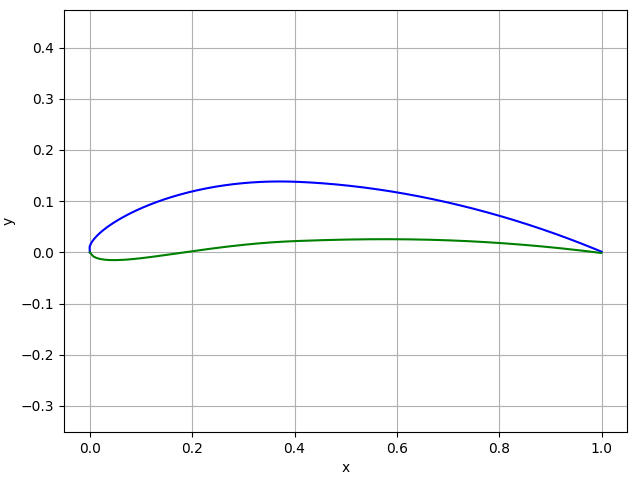

Welcome to |name|'s documentation!
==================================

*Airfoils* is a small Python library for object-oriented airfoil modelling. Airfoil objects can be imported from files. Airfoil definitions hosted on the `UIUC Airfoil Coordinates Database <https://m-selig.ae.illinois.edu/ads/coord_database.html>`_ are supported. Alternatively, airfoil objects can be instantiated from a NACA-4-series definition.

Example
-------

.. code:: python

    >>> from airfoils import Airfoil
    >>> naca4412 = Airfoil.NACA4('4412')
    >>> naca4412.plot()

.. toctree::
   :maxdepth: 2
   :caption: User guide

   user_guide/installation
   user_guide/detailed_user_guide

.. toctree::
   :maxdepth: 1
   :caption: Changelog

   CHANGELOG

.. toctree::
   :maxdepth: 1
   :caption: Developer documentation

   dev_doc/modules_main

Licence information
-------------------

|name| is developed at `Airinnova AB`_, Stockholm.

:Authors:
    |author1|

:Licence:
    |license|
