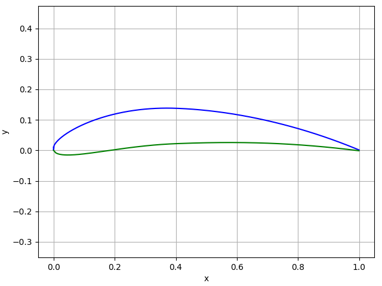

Welcome to |name|'s documentation!
==================================

.. image:: _static/images/logo.svg
    :alt: Airfoils
    :width: 250 px
    :scale: 100 %

*Airfoils* is a small *Python* library for object-oriented airfoil modelling. The library provides tools to easily instantiate airfoil objects and to query geometric information. An airfoil object is defined by upper and a lower surface coordinates.

Features
--------

* Airfoil generation with a *NACA-4* series definition

* Import from files

    * Full support for airfoils from the `UIUC Airfoil Coordinates Database <https://m-selig.ae.illinois.edu/ads/coord_database.html>`_

* Interpolation or computation of airfoil geometry parameters

    * Upper and lower surface coordinates
    * Camber line coordinates
    * Chord line coordinates (TODO)
    * Thickness distribution (TODO)
    * Maximum thickness (TODO)

* Linear interpolation between two different airfoils (*MorphAirfoil*)

* Plotting of airfoils

Example
-------

.. code:: python

    >>> from airfoils import Airfoil
    >>> foil = Airfoil.NACA4('4812')
    >>> foil.plot()

.. code:: python

    >>> foil.y_upper(x=0.5)
    array(0.13085448)
    >>> foil.y_lower(x=[0.2, 0.6, 0.85])
    array([0.00217557, 0.02562315, 0.01451318])
    >>> foil.camber_line(x=0.5)
    0.07789290253609385

.. toctree::
   :maxdepth: 2
   :caption: User guide

   user_guide/installation
   user_guide/detailed_user_guide

.. toctree::
   :maxdepth: 1
   :caption: Changelog

   CHANGELOG

.. toctree::
   :maxdepth: 1
   :caption: Developer documentation

   dev_doc/modules_main

Licence information
-------------------

|name| is developed at `Airinnova AB`_, Stockholm.

:Authors:
    |author1|

:Licence:
    |license|
