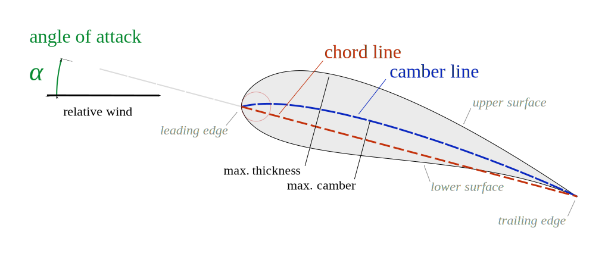

.. _detailed_user_guide:

User guide
==========

General notes
-------------

Airfoils are geometric objects that can be described in a *x-y-plane*. Every airfoil has an *upper* and a *lower* side.

    Airfoil nomenclature. Image in the public domain, via `Wikimedia Commons <https://commons.wikimedia.org/wiki/File:Wing_profile_nomenclature.svg>`_.

.. seealso::

    For general airfoil information and nomenclature see:

    * https://en.wikipedia.org/wiki/Airfoil

Creating an airfoil object
--------------------------

|name| has multiple constructor methods.

**TODO**

.. image:: ../_static/images/example.png
    :width: 600 px
    :target: https://github.com/airinnova/airfoils
    :alt: Example

Airfoil object methods
----------------------

**TODO**

API documentation
-----------------

Details for the |name| API can be found here:

* :ref:`module_descriptions`
